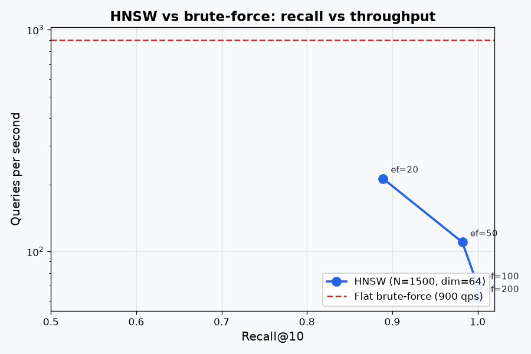
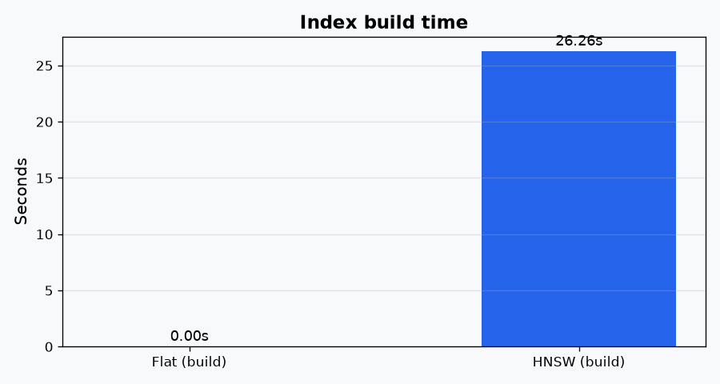

# Benchmarks & Tradeoffs

The primary reason to use `HNSW` over a brute-force `FlatIndex` is the **Recall vs Throughput** tradeoff.

Exact search (`FlatIndex`) calculates the distance between your query and *every single vector* in the index. This yields 100% recall but scales linearly, $O(N)$. HNSW navigates a hierarchical graph to find approximate nearest neighbors in $O(\log N)$ time.

## Recall vs QPS

We evaluated vecq's HNSW implementation on a synthetic clustered dataset.



HNSW exposes one crucial tuning knob during search: `ef_search`. 
* **Bigger `ef_search`**: The beam search walks more of the graph, yielding higher recall but taking more time per query. 
* **Smaller `ef_search`**: Fast, but risks missing the true nearest neighbors.

From the chart:
- At `ef_search=20`, we trade recall (~0.89) for extreme speed (~213 queries per second).
- At `ef_search=100`, we hit perfect 1.00 recall at ~70 queries per second.

The right point depends entirely on your application's tolerance for "almost right" answers.

## Build Time

Constructing the HNSW graph is an $O(N \cdot efConstruction \cdot M)$ operation. 



Because Python is interpreted, building massive graphs takes time. vecq is optimized using batched NumPy distance computations in the hot loop (`_distances_batch`), which makes it vastly faster than pure scalar Python, but it remains a prototyping tool. For million-scale production indexing, you should reach for C++ implementations like `hnswlib`.

## Running the Benchmarks Yourself

vecq includes a built-in benchmark harness. You can run it locally to generate these tables and charts for your own machine:

```bash
# Generate a dataset of 10,000 vectors and benchmark them
vecq bench --n 10000 --dim 128 --k 10 --out ./results
```

This will output a CSV of the results and generate new PNG charts in the `./results` directory!
